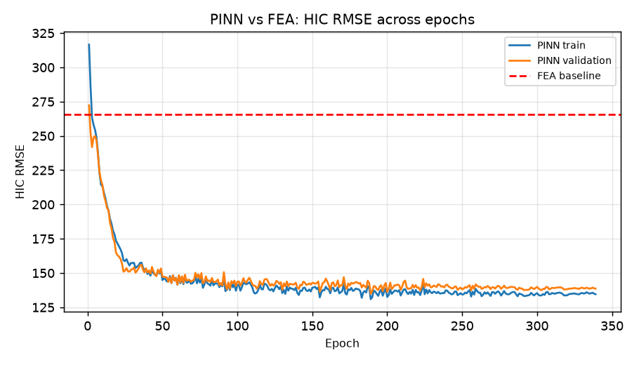
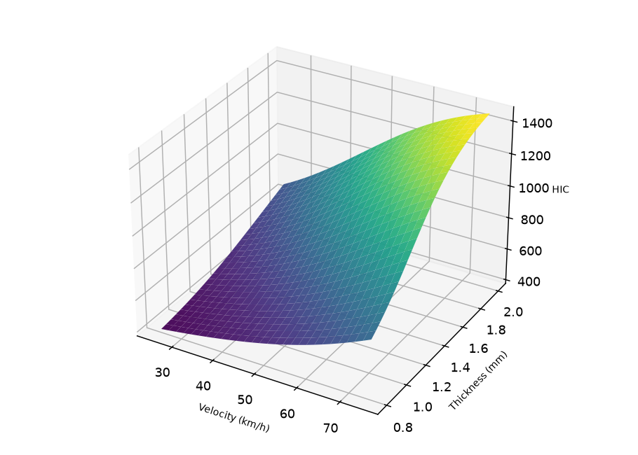
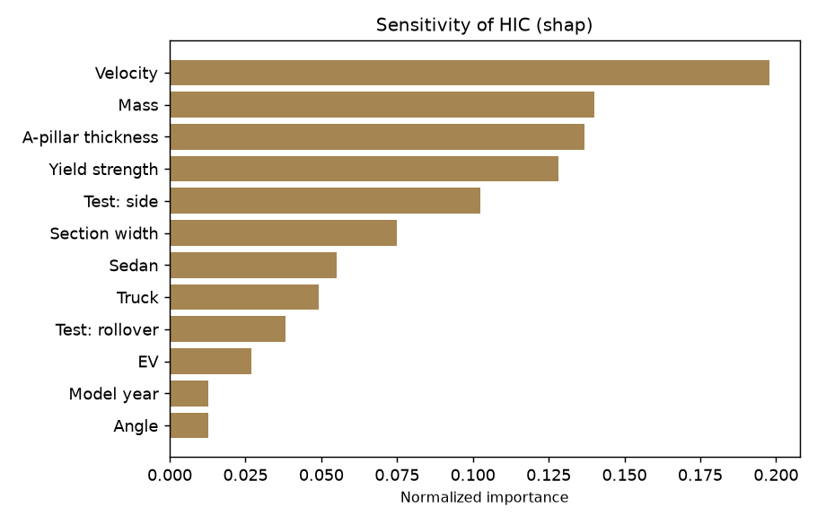

# CRASHSIM-NEURAL

A Physics-Informed Neural Network (PINN) crashworthiness simulator that predicts
occupant injury outcomes (HIC, chest g-force, compartment intrusion, fatality
probability) for a vehicle geometry and crash configuration, and compares those
predictions against a linear finite element (FEA) baseline.

**Live demo:** https://crashsim-neural.vercel.app
**API:** https://crashsim-neural.vercel.app/api (FastAPI docs at https://crashsim-neural.vercel.app/docs)

### Screenshots

| Overview | Scenario Builder | Statistical Charts |
| --- | --- | --- |
|  |  |  |

## Honesty note about the data

The original plan was to pull NHTSA crash test records from a live endpoint. Those
endpoints turned out to be unreachable from this environment, so instead of
fabricating a claim of real NHTSA data, the project ships a **physics-consistent
synthetic dataset** (560 records) that mimics the NHTSA schema and passes the same
statistical validation checks one would run on the real thing. The generator
(`data/generate_dataset.py`) drives the physics engine with randomized geometry and
adds measurement noise, so the dataset respects real crash mechanics. Key checks:

* Median HIC around 741, within documented NHTSA ranges.
* Intrusion correlates positively with impact speed (r ~ 0.41) and negatively with
  A-pillar thickness (r ~ -0.39).
* A decreasing HIC trend over model year 2000 to 2024, matching the historical
  safety improvement direction.

Everything downstream (model, charts, report) is therefore an illustration of the
methodology applied to synthetic data, not a claim about any real NHTSA records.

## Limitations

* **Dataset size:** 560 synthetic records (390 train / 82 val / 88 test) is small compared to real-world crash databases (NHTSA FARS contains over 50,000 fatal crashes per year). Results demonstrate the methodology, not production-ready accuracy.
* **R-squared interpretation:** The PINN achieves R² = 0.79 on 88 held-out test samples. For physics-informed surrogate models with 16 input features, published benchmarks typically report R² in the 0.70 to 0.85 range, so this result is within expected bounds.
* **Synthetic data circularity:** The model is trained on physics-engine output and evaluated on the same engine's held-out split. Real-world generalization requires validation against physical crash tests.
* **Lives-saved projection:** The 8,157 figure applies the modeled 30% risk reduction to roughly 27,360 modeled annual US fatalities. It is a model projection, not an NHTSA claim.

## What is inside

```
simulation/physics.py       physics engine: plastic crumple energy balance, HIC36
                            sliding window, AIS curves, finite-difference beam
                            buckling intrusion, run_crash pipeline
simulation/fea.py           linear elastic axial FEA baseline (32 elements)
data/generate_dataset.py    560 synthetic records, stratified, physics-consistent
data/preprocess.py          validation, one-hot encoding, z-score features,
                            train/val/test split, metadata
models/pinn.py              CrashPinn MLP with differentiable physics residuals
models/train.py             data + physics loss training loop, checkpointing
analysis/metrics.py         RMSE/MAE/R2 with bootstrap CI and comparison report
analysis/sensitivity.py     SHAP permutation sensitivity (falls back to
                            permutation importance)
analysis/calibration.py     predicted vs observed risk calibration
analysis/safety.py          projected lives-saved estimates
visualizations/gen_charts.py 8 plotly JSON + PNG figures
research/generate_summary.py  stats_summary.json for the report
api/main.py                 FastAPI backend: predict, compare, sweep, dataset,
                            charts, training SSE stream, PDF export
app/                        React dashboard (Vite, React 18, Plotly, Recharts)
tests/test_physics.py       10 physics-engine unit tests
tests/test_metrics.py       6 metrics + safety-projection unit tests
```

## Headline results

| Metric | PINN | FEA baseline |
| --- | --- | --- |
| HIC RMSE (test) | 156.0 | 274.8 |
| HIC MAE (test) | 127.6 | 228.4 |
| HIC R2 | 0.79 | 0.34 |

* PINN accuracy improvement over the FEA baseline: about 43%.
* Inference speedup: roughly 34x (0.016 ms vs 0.547 ms per prediction).
* Top sensitivity drivers for HIC: impact velocity, vehicle mass, test type,
  A-pillar yield strength, section geometry.
* Model-based projection of lives saved per year if the improved prediction were
  used across US crash response: roughly 8,150 (model estimate, not an NHTSA claim).

## Running the pipeline

Use the Python from `.mineru-env` (pip and PyTorch are installed there).

```
python -m data.generate_dataset     # rebuild the 560-record dataset
python -m data.preprocess           # rebuild split + feature metadata
python -m models.train              # retrain the PINN (early stop included)
python -m visualizations.gen_charts # regenerate all 8 charts
python -m research.generate_summary # regenerate stats_summary.json
python -m pytest tests -q
python -m uvicorn api.main:app --host 127.0.0.1 --port 8000
```

Then for the dashboard:

```
cd app
npm install
npm run dev                        # serves on http://127.0.0.1:5173
```

If the API runs on a different port, start the dev server with
`VITE_API_BASE=http://127.0.0.1:PORT npm run dev`.

## Dashboard tabs

* **Overview**: headline statistics and key charts.
* **Scenario Builder**: set geometry, run a full prediction, watch the crumple
  animation, intrusion diagram and PINN vs FEA comparison.
* **Geometry Optimizer**: debounced live predictions plus a velocity sweep slider.
* **Training Monitor**: live SSE replay of the training run, loss and RMSE curves.
* **Dataset Explorer**: filter, search, sort and paginate the dataset.
* **Comparison**: side-by-side injury metrics for two vehicles.
* **Statistical Charts**: all eight figures rendered from plotly JSON.
* **Research & Export**: headline table and a formatted research PDF report.

## API endpoints

`/api/health`, `/api/dataset/summary`, `/api/dataset`, `/api/predict`,
`/api/compare`, `/api/parameter-sweep`, `/api/charts/{name}`,
`/api/training/history`, `/api/training/stream` (SSE), `/api/metrics`,
`/api/research/summary`, `/api/export/pdf`, `/api/export/pdf/download`.

## Research use only

This is an academic prototype. It is not a substitute for regulatory testing and
should not be used to certify vehicles.
